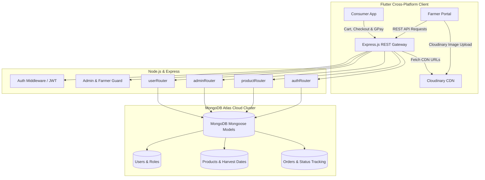

# 🌾 RaithaSethu (ರೈತ ಸೇತು)
### *Direct Farm-to-Consumer Agritech Marketplace & Sustainable Supply Chain Platform*

[](https://flutter.dev)
[](https://dart.dev)
[](https://nodejs.org)
[](https://www.mongodb.com)
[](https://cloudinary.com)
[](#native-checkout--payments)
[](#farmer-analytics--revenue-engine)
[](#)

---

## 📋 Apple Developer Academy Indonesia — Portfolio Case Study

> **Portfolio Submission Format**: `FullName_Portfolio_Academy` → **`YashManjunath_Portfolio_Academy`**  
> **Applicant**: Yash Manjunath (`yashyashwanth7447@gmail.com`)  
> **Project Showcase**: Selected Best Work (3 of 5)

| Portfolio Requirement | Project Case Study Detail |
|:---|:---|
| **Project Summary** | *RaithaSethu* ("The Farmer's Bridge") is an end-to-end agritech commerce ecosystem connecting rural smallholder farmers directly with urban consumers, eliminating predatory intermediaries to deliver fair farmgate pricing to growers and fresh, harvest-traceable produce to buyers. |
| **Project Nature** | **Self-Initiated Independent Project** *(Full-Stack Mobile Architect, Backend Engineer & UI/UX Designer)*. |
| **My Role & Impact** | Single-handedly conceptualized, architected, and built both the cross-platform Flutter application and the Node.js/Express REST API backed by MongoDB Atlas. Engineered role-based access for Farmers (inventory listing, Cloudinary photo uploads, real-time revenue analytics via `fl_chart`) and Consumers (multi-category search, transparent harvest provenance, cart management, native Google Pay/Apple Pay integration, and live order tracking). Disintermediates traditional agricultural supply chains, reclaiming 30–50% lost profit margins for growers. |
| **What I Learned** | Mastered full-stack mobile systems engineering: architecting decoupled Node.js/Express REST micro-endpoints, MongoDB schema design with Mongoose, state management via Provider, integrating hardware-accelerated mobile payments (`pay` package), cloud media delivery pipelines, and designing accessible UIs tailored to diverse demographic digital literacy levels. |

---

## 💡 Academy Core Evaluation Alignment

### 1. Interest & Motivation
In rural India and developing agricultural economies worldwide, smallholder farmers often receive merely 20–30% of the final retail price paid by consumers. The remainder is swallowed by a chain of exploitative middlemen, commission agents, and opaque wholesalers. Having witnessed first-hand the economic distress this inflicts on farming families, I was driven to engineer *RaithaSethu* (which translates from Kannada as *"Farmer's Bridge"*). My vision was to harness consumer smartphones and cloud technology to create a disintermediated, transparent marketplace where farmers control their own prices and consumers receive authentic, locally grown harvest. Building technology that generates tangible, life-changing socio-economic impact is the core motivation I bring to the Apple Developer Academy.

### 2. Creativity & Expression
Designing for two fundamentally distinct user groups within a single cohesive platform demanded deep creative problem-solving:
* **The Farmer Command Center**: Tailored for growers who need maximum utility with minimal friction. Features large, readable typography, high-contrast agricultural green accents, one-tap photo uploads via Cloudinary, and glanceable visual revenue charts (`fl_chart`) that turn raw sales numbers into actionable business insights.
* **The Consumer Farm-to-Table Experience**: Designed an inviting, cheerful digital bazaar featuring custom agricultural category carousels (Food, Feed, Fiber, Oil Seeds, Industrial), real-time search with instant item suggestions, transparent harvest date badges, and a frictionless checkout flow.
* **Branding & Visual Identity**: Crafted the *"RaithaSethu"* emblem—a modern digital shopping cart radiating local Wi-Fi/connectivity signals—symbolizing the fusion of traditional farming with mobile disintermediation.

### 3. Interdisciplinary Potential
*RaithaSethu* bridges diverse, impactful domains:
* **Agronomy & Supply Chain Economics**: Tracking crop lifecycles, harvest timestamps, perishability, and fair-trade pricing models across diverse agricultural classes (staples, animal fodder, cash crops, fiber, oil seeds).
* **Full-Stack Cloud Architecture**: Building scalable REST APIs using Node.js/Express, document-oriented persistence with MongoDB Atlas, and stateless JWT authentication.
* **Fintech & Native Mobile Transactions**: Implementing seamless digital payment gateways supporting native mobile wallets (Google Pay and Apple Pay) alongside cash-on-delivery.
* **Human-Centered Design (HCD)**: Bridging digital literacy gaps through visual-first navigation, voice search integration, and intuitive color-coded order fulfillment stages.

### 4. Work Ethic & Excellence
From engineering the Node.js backend with defensive middleware validation to creating seamless data binding with Provider in Flutter, the project demonstrates production-grade discipline. Every critical user interaction—from stock quantity decrementing during checkout to Cloudinary multipart image streaming, cart persistence, and order status transitions (Pending $\to$ Completed $\to$ Received $\to$ Delivered)—is built with fault tolerance and responsive user feedback.

---

## 🎯 The Paradigm Shift: Middleman Monopoly vs. Direct Disintermediation

```
┌────────────────────────────────────────────────────────────────────────┐
│                   THE TRADITIONAL EXPLOITATIVE CHAIN                   │
│  Farmer (₹15/kg) ──> Village Agent ──> Wholesaler ──> Distributor      │
│                  ──> Urban Retailer ──> Consumer (₹70/kg)              │
│                                                                        │
│  ❌ Farmer receives < 25% of final value                               │
│  ❌ Produce takes 4-7 days to reach shelf (Stale / High Waste)         │
│  ❌ Consumer has zero insight into harvest date, origin, or chemicals   │
└───────────────────────────────────┬────────────────────────────────────┘
                                    │
                                    ▼
┌────────────────────────────────────────────────────────────────────────┐
│                     THE RAITHASETHU DIRECT BRIDGE                      │
│            Farmer (Direct Listing: ₹50/kg) ───[RaithaSethu]───►        │
│                         Consumer Pays: ₹50/kg                          │
│                                                                        │
│  ✅ Farmer earns 3x more profit (₹50 vs ₹15)                           │
│  ✅ Consumer pays 30% less (₹50 vs ₹70)                                │
│  ✅ Harvested yesterday: Unmatched freshness & nutrition               │
│  ✅ Verified harvest timestamps & direct producer accountability       │
└────────────────────────────────────────────────────────────────────────┘
```

---

## 📱 Visual Story & Application Walkthrough

The following 18 screenshots capture the full operational lifecycle of **RaithaSethu**, demonstrated on real mobile hardware connected to the live Node.js/MongoDB backend.

### Phase 1: Dual-Sided Agritech Gateway & Role Onboarding
Upon launch, users encounter the welcoming portal emphasizing the mission to disintermediate agricultural trade. Users select their identity: **Farmer** (seller/producer) or **Customer** (buyer), routing to dedicated authentication pipelines.

| RaithaSethu Welcome Portal | Farmer Sign In | Farmer Account Registration |
|:---:|:---:|:---:|
|  |  |  |
| *Role selection gateway displaying "Made by YASH", direct farm-to-table mission banner, and role selection cards.* | *Dedicated farmer authentication portal with secure credentials and direct producer access.* | *Comprehensive grower onboarding capturing farm address, phone number, and institutional details.* |

| Customer Sign In | Customer Account Creation |
|:---:|:---:|
|  |  |
| *Clean, welcoming customer sign-in screen connecting consumers with verified local farmers.* | *Frictionless buyer registration collecting name and verified email for instant ordering.* |

---

### Phase 2: Consumer Farm-to-Table Marketplace & Discovery
The consumer home hub provides an intuitive e-commerce experience: live search with voice recognition, delivery address picker, high-resolution agricultural banners, and structured crop categories.

| Consumer Home Marketplace | Real-Time Voice & Text Search | Category: Food Produce |
|:---:|:---:|:---:|
|  |  |  |
| *Marketplace dashboard featuring category carousels (Food, Feed, Fiber, Oil Seeds, Industrial) and delivery location.* | *Instant search query matching ("to") displaying live catalog items, ratings, and free shipping badges.* | *Category deals showcasing freshly harvested produce: Carrots (₹50 & ₹20) and Tomatoes (₹70).* |

| Category: Animal Feed (Ragi) | Category: Fiber Crops (Cotton) | Category: Oil Seeds (Sunflower) | Category: Industrial Crops (Tobacco) |
|:---:|:---:|:---:|:---:|
|  |  |  |  |
| *Direct farmer listing for finger millet / ragi fodder at ₹80/kg.* | *Direct farm-origin raw cotton harvest available at ₹100/kg.* | *Sunflowers listed directly from oilseed growers at ₹200/kg.* | *Industrial tobacco leaves listed directly from licensed farm plots at ₹1000/kg.* |

---

### Phase 3: Harvest Provenance, Cart & Native Checkout
Transparency is central to *RaithaSethu*. Each product page details exact farmgate pricing, current available stock in kilograms, and the **precise harvest timestamp**, guaranteeing true farm freshness.

| Crop Harvest & Origin Details | Active Shopping Cart | Delivery Address & GPay Checkout |
|:---:|:---:|:---:|
|  |  |  |
| *Tomato details highlighting harvest timestamp (2026-09-24), available stock (70 kg), and "Buy Now" CTA.* | *Cart calculating real-time subtotal (₹280 for 4 kg), free shipping badge, and quantity stepper controls.* | *Native checkout screen supporting instant Google Pay integration, cash on delivery, and address capture.* |

---

### Phase 4: Order Lifecycle & Farmer Commerce Analytics
Once an order is placed, both parties enjoy real-time transparency. Consumers monitor a 4-stage tracking stepper, while farmers manage their inventory and track overall business earnings through interactive charts.

| Real-Time Order Tracking Stepper | Farmer Dashboard: Produce Inventory | Farmer Analytics: Revenue Bar Chart |
|:---:|:---:|:---:|
|  |  |  |
| *Order audit sheet (ID: 6ab632...) showing total (₹280), purchased items, and active 4-phase tracking stepper.* | *Farmer produce management hub with high-res photo cards, delete triggers, and FAB to list new crops.* | *Interactive visual earnings engine powered by FL Chart showing category sales and total revenue (₹280).* |

---

## 🏗️ System Architecture & Data Pipeline

*RaithaSethu* utilizes a decoupled client-server architecture built for high performance and low-latency mobile networking:



---

## 🛠️ Technology Stack Breakdown

| Layer | Technology | Key Capabilities & Purpose |
|:---|:---|:---|
| **Mobile Client** | [Flutter 3.29](https://flutter.dev) & [Dart 3.7](https://dart.dev) | Responsive cross-platform interface compiled natively for Android & iOS. |
| **State Management** | [Provider 6.1.2](https://pub.dev/packages/provider) | Decoupled user session management, cart reactivity, and product feeds. |
| **Backend Server** | [Node.js](https://nodejs.org) & [Express.js](https://expressjs.com) | High-throughput asynchronous REST API server running on port `3001`. |
| **Database** | [MongoDB Atlas](https://www.mongodb.com) & [Mongoose](https://mongoosejs.com) | Flexible, document-oriented persistence for complex crop and order structures. |
| **Media Pipeline** | [Cloudinary](https://cloudinary.com) (`cloudinary_public`) | Cloud-hosted CDN for rapid multi-image crop photo uploads from mobile camera. |
| **Native Payments** | [pay 3.2.0](https://pub.dev/packages/pay) | Direct Google Pay and Apple Pay native mobile wallet integration. |
| **Visual Analytics** | [fl_chart 0.70.2](https://pub.dev/packages/fl_chart) | Dynamic bar charts and sales performance visualizations for agricultural earnings. |
| **Media Picking** | [file_picker 8.3.5](https://pub.dev/packages/file_picker) & [dotted_border](https://pub.dev/packages/dotted_border) | Tactile photo selection with intuitive dashed-border drag-and-drop frames. |

---

## 📂 Project Directory Structure

```
RaithaSethu/
├── lib/
│   ├── common/                      # Common UI components (buttons, text fields, bottom bar)
│   ├── constants/                   # Global endpoints, category lists, color palette & error handlers
│   │   ├── error_handling.dart      # HTTP response status handler & SnackBar alerts
│   │   ├── global_variables.dart    # MongoDB server URLs, colors & asset paths
│   │   └── utils.dart               # Image picking & snackbar helpers
│   ├── features/                    # Modular feature-driven architecture
│   │   ├── account/                 # User profile, past orders & account settings
│   │   ├── address/                 # Delivery address management & GPay checkout integration
│   │   ├── admin/                   # Farmer admin dashboard, product upload & FL Chart analytics
│   │   ├── auth/                    # Split authentication screens (farmer_auth.dart, user_auth.dart)
│   │   ├── cart/                    # Cart state, subtotal computations & quantity steppers
│   │   ├── home/                    # Carousel slider, deal of the day & category showcases
│   │   ├── order_details/           # 4-stage visual order tracking stepper
│   │   ├── product_deatails/        # Harvest dates, available kg stock & direct purchase
│   │   └── search/                  # Real-time search query delegate & filter chips
│   ├── models/                      # Typed serialization models (User, Product, Order)
│   ├── providers/                   # Provider state containers (UserProvider, CartProvider)
│   ├── router.dart                  # Named route transitions
│   ├── first_screen.dart            # Dual-role gateway splash portal
│   └── main.dart                    # App initialization, token verification & theme setup
├── server/                          # Node.js backend
│   ├── index.js                     # Express app, middleware pipeline & MongoDB Atlas connection
│   ├── middlewares/                 # JWT auth verification & admin/farmer role validation
│   ├── models/                      # Mongoose schemas (user.js, product.js, order.js)
│   └── routes/                      # REST endpoints (auth.js, product.js, admin.js, user.js)
└── assets/
    ├── gpay.json                    # Google Pay payment configuration
    ├── images/                      # Vector illustrations & static category icons
    └── screenshots/                 # 18 high-resolution real-device portfolio screenshots
```

---

## 🚀 Running the Project Locally

### 1. Start the Node.js / MongoDB Server
```bash
cd "c:\Users\yashy\Yash App Project\RaithaSethu\server"
npm install
npm run dev
# Server will launch on port 3001 and connect to MongoDB Atlas
```

### 2. Launch the Flutter Mobile App
```bash
cd "c:\Users\yashy\Yash App Project\RaithaSethu"
flutter pub get
flutter run
```

---

## 🌟 Future Vision & Apple Ecosystem Roadmap

At the **Apple Developer Academy**, I aim to elevate *RaithaSethu* by harnessing cutting-edge iOS capabilities:

* **CoreML & Vision Framework for Crop Health**: Integrate on-device machine learning models to allow farmers to snap a photo of their crops to instantly diagnose leaf blights, pest infestations, or nutrient deficiencies before harvesting.
* **Apple WeatherKit Integration**: Provide hyper-localized microclimate precipitation and soil moisture forecasts directly on the farmer's dashboard, assisting in optimal harvest timing.
* **Dynamic Island & Live Activities (`ActivityKit`)**: Allow consumers to track their farm-to-table delivery in real time on the Dynamic Island, monitoring when their produce is harvested, dispatched, and arriving at their doorstep.
* **Apple Pay Native PassKit**: Enable seamless one-touch Apple Pay transactions with biometric FaceID/TouchID confirmation.
* **iPadOS Pro Dashboard**: Design a multi-column farmer cooperative dashboard leveraging SwiftUI and Swift Data for agricultural cooperatives managing high-volume harvests and multi-truck dispatches.

---

<p align="center">
  <b>Engineered with pride by Yash Manjunath</b><br>
  <i>Submitted for the Apple Developer Academy Indonesia Cohort</i>
</p>
